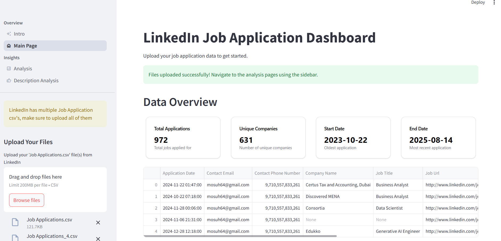
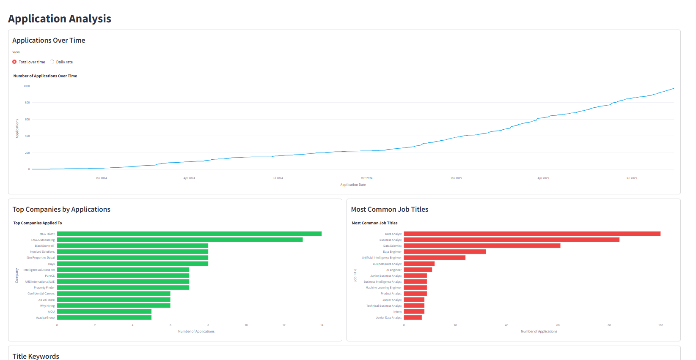
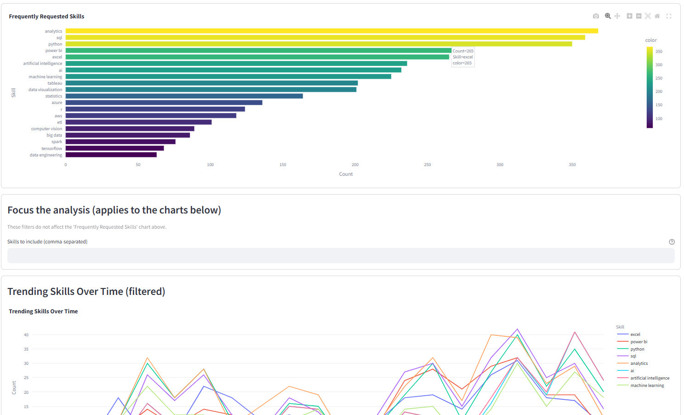

# LinkedIn Job Application Dashboard

📈 A powerful, interactive dashboard built with Streamlit to visualize and analyze your LinkedIn job application data.

## Overview

This dashboard allows you to upload your LinkedIn job application data and gain valuable insights through interactive visualizations and detailed analytics. Whether you're tracking your job search progress or looking to optimize your application strategy, this tool provides comprehensive analysis of your job application journey.

## Features

- 📊 **Interactive Data Visualization**: Dynamic charts and graphs showing your application patterns
- 🏢 **Company Analysis**: Track applications across different companies
- 📅 **Temporal Analysis**: View your application timeline and patterns
- 📈 **Application Metrics**: Key statistics about your job search
- 🔍 **Skills Analysis**: Analyze job descriptions and required skills

## Dashboard Screenshots

### Main Dashboard

The main dashboard page where you can upload your LinkedIn job application CSV files. It displays key metrics including total applications, unique companies applied to, and your application date range, giving you a quick overview of your job search journey.

### Application Analysis

The analysis page provides detailed insights into your job search patterns through interactive visualizations. You can see your daily application trends, top companies you've applied to, and the distribution of job titles, helping you understand your application strategy.

### Skills Analysis

This page analyzes the job descriptions from your applications to identify key skills and requirements. It helps you understand the most in-demand skills in your field and can guide your skill development priorities.

## Getting Started

### Prerequisites

- Python 3.x
- pip (Python package manager)

### Installation

1. Clone the repository:
```bash
git clone https://github.com/cyborgsuh/LinkdIn-Job-Visualization-Dashboard.git
cd LinkdIn-Job-Visualization-Dashboard
```

2. Install required dependencies:
```bash
pip install -r requirements.txt
```

### Running the Application

1. Launch the dashboard:
```bash
streamlit run app.py
```

2. Open your web browser and navigate to the provided local URL (typically http://localhost:8501)

### Using the Dashboard

1. Export your job applications data from LinkedIn:
   - Go to your LinkedIn profile
   - Click on your profile.
   - Settings & Privacy > Data Privacy > Get a copy of your data
   - Download your application history as CSV

2. Upload your CSV file(s) to the dashboard
3. Explore different sections:
   - Overview: General statistics and key metrics
   - Application Analysis: Detailed visualization of your application patterns
   - Skills Analysis: Analysis of job descriptions and required skills

## Project Structure

```
├── app.py                 # Main application file
├── pages/
│   ├── 0_Intro.py        # Introduction page
│   ├── 1_Application_Analysis.py   # Application analysis
│   ├── 2_ScrapeAnd_Analyze_Skills.py   # Skills analysis
│   └── Main.py           # Main dashboard page
└── scrape.ipynb          # Jupyter notebook for data scraping
```

## Technologies Used

- **Streamlit**: For the web application framework
- **Pandas**: For data manipulation and analysis
- **Plotly**: For interactive visualizations

## Features in Detail

### Overview Page
- Total number of applications submitted
- Number of unique companies
- Application date range
- Quick view of recent applications

### Application Analysis
- Daily/weekly/monthly application trends
- Company distribution

### Skills Analysis
- Common skills requirements
- skill-specific trends
- Keyword frequency analysis

## Contributing

Contributions are welcome! Please feel free to submit a Pull Request.

## License

This project is licensed under the MIT License - see the LICENSE file for details.

## Acknowledgments

- LinkedIn for providing exportable job application data
- Streamlit for their excellent framework
- The open-source community for various dependencies used in this project

## Support

If you encounter any issues or have questions, please file an issue on the GitHub repository.
